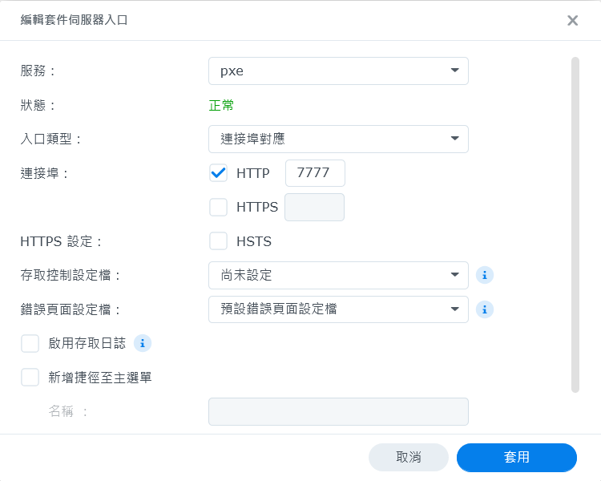
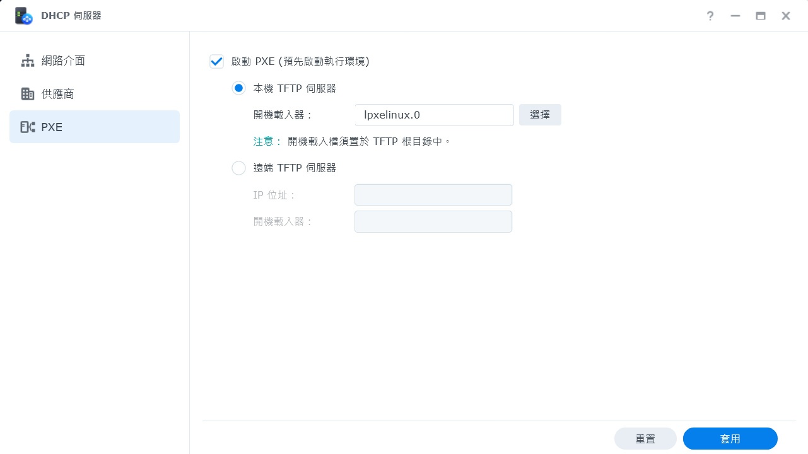

# Synology 設定

首先要在 Synology 啟動 TFTP 服務，然後在網路設定 PXE 開機的引導檔案

## 1. 啟動 TFTP 伺服器

1. 下載 PXE 需要的檔案，放置於 Synology 伺服器中，範例放置於 pxe 資料夾中。[<下載連結>](./download/pxe.zip)
    * 傳統 BIOS 開機由 SYSLINUX 6.03 提供
    * UEFI Grub 開機使用 Ubuntu Netboot，不支援 Secure Boot

2. 到**控制台** → **檔案服務** → **進階設定**，啟動 TFTP 伺服器，設定 TFTP 根目錄為放置 SYSLINUX 檔案的資料夾。


## 2. 設定 HTTP 伺服器

1. 安裝 Web Station 套件，設定可以存取 pxe 資料夾。建議可以使用**連接埠對應**模式來存取，再透過防火牆限制只能透過內部網路存取。


## 3. 設定 PXE 引導檔案（傳統 BIOS）

1. 到 **DHCP 伺服器** → **PXE**，勾選**啟動 PXE（預先執行環境）**，設定開機載入器為 pxe 目錄下的 lpxelinux.0 檔案。


## 4. 設定 PXE 引導檔案（UEFI）

1. 先設定 Synology 可以用 ssh 登入，請參考[如何透過 SSH 以 root 權限登入 DSM](https://kb.synology.com/zh-hk/DSM/tutorial/How_to_login_to_DSM_with_root_permission_via_SSH_Telnet)。

2. 使用 SSH 客戶端軟體登入，修改 **/etc/dhcpd/dhcpd-pxe.conf** 檔案（可使用 `vi`）：

```bash
# 註解以下兩行
# dhcp-boot=tag:pxe,lpxelinux.0
# dhcp-vendorclass=set:pxe,PXEClient

#新增以下三行，在 X.X.X.X 輸入伺服器 IP
dhcp-boot=lpxelinux.0,pxeserver,X.X.X.X
dhcp-match=set:efi-x86_64,option:client-arch,7
dhcp-boot=tag:efi-x86_64,grub/bootx64.efi
```
